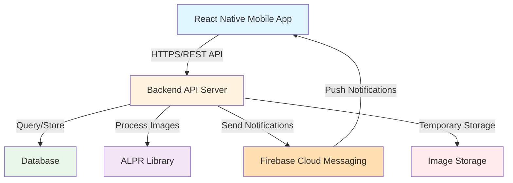
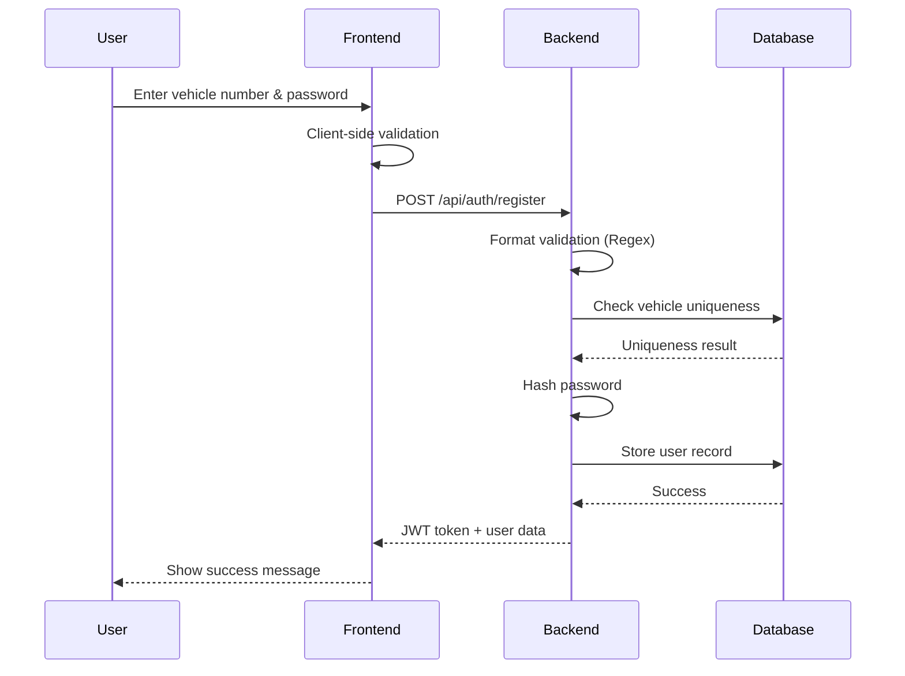
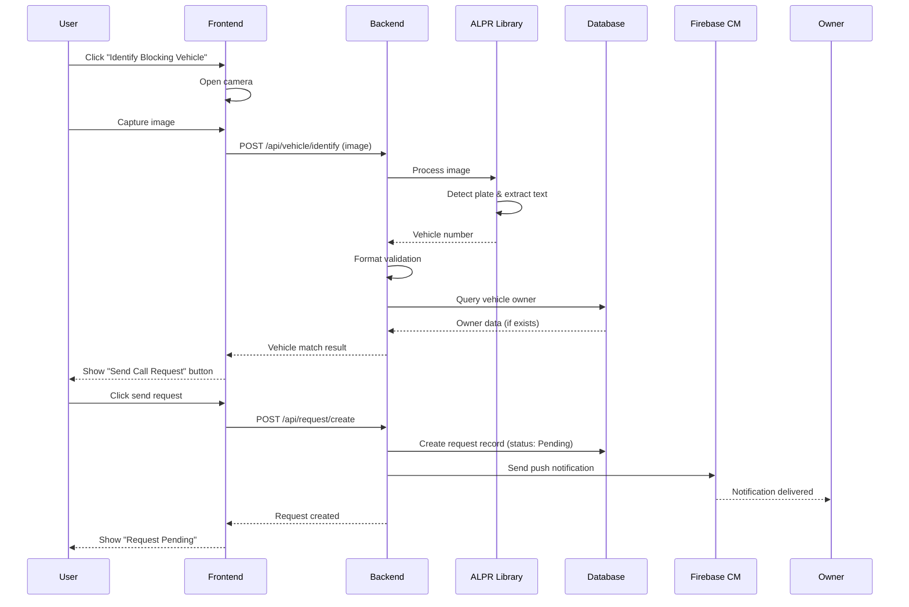
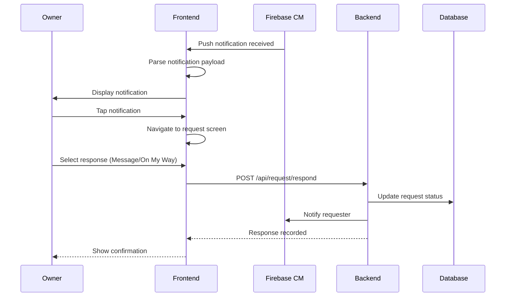

# Design Document: FreeWay Community

## Overview

FreeWay Community is a privacy-focused mobile application that resolves vehicle blocking issues through automated license plate recognition and notification-based communication. The system enables users to identify blocking vehicles via image capture or manual entry, then sends call requests to vehicle owners without exposing personal contact information. Built with React Native frontend and a backend API layer, the application integrates ALPR technology for automatic vehicle number extraction and Firebase Cloud Messaging for real-time notifications. The architecture prioritizes user privacy by avoiding phone number sharing, implementing temporary image storage, and using secure token-based authentication.

## Architecture

The system follows a client-server architecture with clear separation between frontend, backend, and external services.




## Main Workflows

### User Registration Sequence



### Vehicle Identification & Call Request Sequence




### Notification Handling Sequence



## Components and Interfaces

### Component 1: Authentication Service

**Purpose**: Handles user registration, login, and token management

**Interface**:
```pascal
INTERFACE AuthenticationService
  PROCEDURE register(vehicleNumber: String, password: String): AuthResult
  PROCEDURE login(vehicleNumber: String, password: String): AuthResult
  PROCEDURE validateToken(token: String): ValidationResult
  PROCEDURE refreshToken(token: String): TokenResult
END INTERFACE

STRUCTURE AuthResult
  success: Boolean
  token: String
  userId: UUID
  message: String
END STRUCTURE
```

**Responsibilities**:
- Validate vehicle number format using regex patterns
- Check vehicle uniqueness in database
- Hash passwords using bcrypt or similar
- Generate and validate JWT tokens
- Manage secure session storage


### Component 2: ALPR Service

**Purpose**: Processes vehicle images and extracts license plate numbers

**Interface**:
```pascal
INTERFACE ALPRService
  PROCEDURE processImage(imageData: Binary): ALPRResult
  PROCEDURE validatePlateFormat(plateNumber: String): Boolean
  PROCEDURE preprocessImage(imageData: Binary): Binary
END INTERFACE

STRUCTURE ALPRResult
  success: Boolean
  vehicleNumber: String
  confidence: Float
  errorMessage: String
END STRUCTURE
```

**Responsibilities**:
- Receive and preprocess images (resize, enhance contrast)
- Detect license plate regions in images
- Perform character segmentation and OCR
- Extract vehicle numbers with confidence scores
- Validate extracted numbers against format patterns
- Handle ALPR failures gracefully

### Component 3: Vehicle Service

**Purpose**: Manages vehicle registration and identification

**Interface**:
```pascal
INTERFACE VehicleService
  PROCEDURE registerVehicle(userId: UUID, vehicleNumber: String): VehicleResult
  PROCEDURE identifyVehicle(vehicleNumber: String): VehicleOwner
  PROCEDURE getVehiclesByUser(userId: UUID): List<Vehicle>
  PROCEDURE maskVehicleNumber(vehicleNumber: String): String
END INTERFACE

STRUCTURE Vehicle
  id: UUID
  userId: UUID
  vehicleNumber: String
  registeredAt: Timestamp
  isActive: Boolean
END STRUCTURE

STRUCTURE VehicleOwner
  userId: UUID
  vehicleNumber: String (masked)
  fcmToken: String
  found: Boolean
END STRUCTURE
```

**Responsibilities**:
- Store vehicle registrations with owner associations
- Query vehicles by number for identification
- Mask vehicle numbers for privacy (e.g., "ABC***123")
- Validate vehicle number formats
- Handle vehicle not found scenarios


### Component 4: Request Service

**Purpose**: Manages call requests between users

**Interface**:
```pascal
INTERFACE RequestService
  PROCEDURE createRequest(requesterId: UUID, targetVehicle: String): RequestResult
  PROCEDURE respondToRequest(requestId: UUID, response: ResponseType): Boolean
  PROCEDURE getRequestStatus(requestId: UUID): RequestStatus
  PROCEDURE getUserRequests(userId: UUID): List<Request>
END INTERFACE

STRUCTURE Request
  id: UUID
  requesterId: UUID
  targetUserId: UUID
  targetVehicle: String
  status: RequestStatus
  createdAt: Timestamp
  respondedAt: Timestamp
  response: ResponseType
END STRUCTURE

ENUM RequestStatus
  PENDING
  RESPONDED
  RESOLVED
  EXPIRED
  CANCELLED
END ENUM

ENUM ResponseType
  MESSAGE
  ON_MY_WAY
  CANNOT_MOVE
END ENUM
```

**Responsibilities**:
- Create and store call request records
- Track request status lifecycle
- Link requesters with vehicle owners
- Handle request expiration (timeout after N minutes)
- Provide request history for users

### Component 5: Notification Service

**Purpose**: Manages Firebase Cloud Messaging for push notifications

**Interface**:
```pascal
INTERFACE NotificationService
  PROCEDURE registerDevice(userId: UUID, fcmToken: String): Boolean
  PROCEDURE sendCallRequest(targetUserId: UUID, requestData: RequestData): NotificationResult
  PROCEDURE sendResponseNotification(requesterId: UUID, response: ResponseType): NotificationResult
  PROCEDURE unregisterDevice(userId: UUID): Boolean
END INTERFACE

STRUCTURE NotificationResult
  success: Boolean
  messageId: String
  deliveryStatus: DeliveryStatus
  errorMessage: String
END STRUCTURE

STRUCTURE RequestData
  requestId: UUID
  vehicleNumber: String (masked)
  timestamp: Timestamp
END STRUCTURE
```

**Responsibilities**:
- Store and manage FCM device tokens
- Send push notifications via Firebase
- Handle notification delivery confirmation
- Manage notification payload formatting
- Log notification status for debugging


### Component 6: Report Service

**Purpose**: Handles abuse reporting and rate limiting

**Interface**:
```pascal
INTERFACE ReportService
  PROCEDURE reportUser(reporterId: UUID, targetUserId: UUID, reason: ReportReason): Boolean
  PROCEDURE checkRateLimit(userId: UUID): RateLimitStatus
  PROCEDURE blockUser(userId: UUID, duration: Integer): Boolean
  PROCEDURE getReportHistory(userId: UUID): List<Report>
END INTERFACE

STRUCTURE Report
  id: UUID
  reporterId: UUID
  targetUserId: UUID
  reason: ReportReason
  timestamp: Timestamp
  status: ReportStatus
END STRUCTURE

ENUM ReportReason
  SPAM
  HARASSMENT
  FALSE_REQUEST
  ABUSE
  OTHER
END ENUM

STRUCTURE RateLimitStatus
  allowed: Boolean
  remainingRequests: Integer
  resetTime: Timestamp
END STRUCTURE
```

**Responsibilities**:
- Record abuse reports with reasons
- Implement rate limiting per user (e.g., max 10 requests/hour)
- Track user behavior patterns
- Apply temporary blocks for repeated abuse
- Provide admin interface for report review

## Data Models

### User Model

```pascal
STRUCTURE User
  id: UUID (Primary Key)
  vehicleNumber: String (Unique, Indexed)
  passwordHash: String
  fcmToken: String (Nullable)
  isActive: Boolean
  isBanned: Boolean
  createdAt: Timestamp
  lastLoginAt: Timestamp
  requestCount: Integer
  reportCount: Integer
END STRUCTURE
```

**Validation Rules**:
- vehicleNumber must match regex pattern (e.g., `^[A-Z]{2}[0-9]{2}[A-Z]{1,2}[0-9]{4}$`)
- passwordHash must be bcrypt hashed with salt
- vehicleNumber must be unique across all users
- fcmToken updated on each login
- requestCount reset daily for rate limiting


### Vehicle Model

```pascal
STRUCTURE Vehicle
  id: UUID (Primary Key)
  userId: UUID (Foreign Key -> User.id, Indexed)
  vehicleNumber: String (Unique, Indexed)
  registeredAt: Timestamp
  isActive: Boolean
  lastIdentifiedAt: Timestamp
END STRUCTURE
```

**Validation Rules**:
- vehicleNumber must be unique
- vehicleNumber must match valid format pattern
- userId must reference existing user
- One user can register multiple vehicles
- Soft delete via isActive flag

### Request Model

```pascal
STRUCTURE Request
  id: UUID (Primary Key)
  requesterId: UUID (Foreign Key -> User.id, Indexed)
  targetUserId: UUID (Foreign Key -> User.id, Indexed)
  targetVehicle: String
  status: RequestStatus (Indexed)
  createdAt: Timestamp (Indexed)
  respondedAt: Timestamp (Nullable)
  expiresAt: Timestamp
  response: ResponseType (Nullable)
  responseMessage: String (Nullable)
END STRUCTURE
```

**Validation Rules**:
- requesterId and targetUserId must be different
- status must be valid enum value
- expiresAt = createdAt + 30 minutes (configurable)
- respondedAt must be after createdAt
- Auto-expire requests after timeout period

### DeviceToken Model

```pascal
STRUCTURE DeviceToken
  id: UUID (Primary Key)
  userId: UUID (Foreign Key -> User.id, Indexed)
  fcmToken: String (Unique)
  platform: Platform (iOS/Android)
  createdAt: Timestamp
  lastUsedAt: Timestamp
  isActive: Boolean
END STRUCTURE
```

**Validation Rules**:
- fcmToken must be unique
- One user can have multiple tokens (multiple devices)
- Inactive tokens removed after 90 days
- lastUsedAt updated on successful notification delivery


### Report Model

```pascal
STRUCTURE Report
  id: UUID (Primary Key)
  reporterId: UUID (Foreign Key -> User.id, Indexed)
  targetUserId: UUID (Foreign Key -> User.id, Indexed)
  reason: ReportReason
  description: String (Nullable)
  status: ReportStatus
  createdAt: Timestamp (Indexed)
  reviewedAt: Timestamp (Nullable)
  reviewedBy: UUID (Nullable)
  action: AdminAction (Nullable)
END STRUCTURE

ENUM ReportStatus
  PENDING
  UNDER_REVIEW
  RESOLVED
  DISMISSED
END ENUM

ENUM AdminAction
  WARNING
  TEMPORARY_BAN
  PERMANENT_BAN
  NO_ACTION
END ENUM
```

**Validation Rules**:
- reporterId and targetUserId must be different
- reason must be valid enum value
- Maximum 5 reports per user per day
- Automatic review triggered after 3 reports against same user

### AuditLog Model

```pascal
STRUCTURE AuditLog
  id: UUID (Primary Key)
  userId: UUID (Foreign Key -> User.id, Indexed)
  action: ActionType
  resourceType: String
  resourceId: UUID
  ipAddress: String
  userAgent: String
  timestamp: Timestamp (Indexed)
  metadata: JSON
END STRUCTURE

ENUM ActionType
  USER_REGISTER
  USER_LOGIN
  VEHICLE_IDENTIFY
  REQUEST_CREATE
  REQUEST_RESPOND
  REPORT_CREATE
  NOTIFICATION_SENT
  NOTIFICATION_FAILED
END ENUM
```

**Validation Rules**:
- All user actions must be logged
- Logs retained for 90 days
- Indexed by userId and timestamp for queries
- metadata stores additional context (e.g., error details)


## API Specifications

### Authentication Endpoints

#### POST /api/auth/register

**Request**:
```pascal
STRUCTURE RegisterRequest
  vehicleNumber: String
  password: String
END STRUCTURE
```

**Response**:
```pascal
STRUCTURE RegisterResponse
  success: Boolean
  token: String
  userId: UUID
  message: String
END STRUCTURE
```

**Status Codes**:
- 201: Registration successful
- 400: Invalid vehicle number format
- 409: Vehicle already registered
- 500: Server error

#### POST /api/auth/login

**Request**:
```pascal
STRUCTURE LoginRequest
  vehicleNumber: String
  password: String
  fcmToken: String (Optional)
END STRUCTURE
```

**Response**:
```pascal
STRUCTURE LoginResponse
  success: Boolean
  token: String
  userId: UUID
  vehicleNumber: String
  message: String
END STRUCTURE
```

**Status Codes**:
- 200: Login successful
- 401: Invalid credentials
- 403: Account banned
- 500: Server error


### Vehicle Endpoints

#### POST /api/vehicle/identify

**Request**:
```pascal
STRUCTURE IdentifyRequest
  image: Binary (Base64 encoded)
  OR
  vehicleNumber: String (Manual entry fallback)
END STRUCTURE
```

**Response**:
```pascal
STRUCTURE IdentifyResponse
  success: Boolean
  vehicleNumber: String (Masked)
  found: Boolean
  canSendRequest: Boolean
  message: String
  confidence: Float (If ALPR used)
END STRUCTURE
```

**Status Codes**:
- 200: Identification successful
- 400: Invalid image or vehicle number
- 404: Vehicle not registered
- 422: ALPR processing failed
- 429: Rate limit exceeded
- 500: Server error

### Request Endpoints

#### POST /api/request/create

**Request**:
```pascal
STRUCTURE CreateRequestRequest
  targetVehicle: String
  message: String (Optional)
END STRUCTURE
```

**Response**:
```pascal
STRUCTURE CreateRequestResponse
  success: Boolean
  requestId: UUID
  status: RequestStatus
  expiresAt: Timestamp
  message: String
END STRUCTURE
```

**Status Codes**:
- 201: Request created successfully
- 400: Invalid vehicle number
- 404: Target vehicle not found
- 429: Rate limit exceeded
- 500: Server error


#### POST /api/request/respond

**Request**:
```pascal
STRUCTURE RespondRequest
  requestId: UUID
  response: ResponseType
  message: String (Optional)
END STRUCTURE
```

**Response**:
```pascal
STRUCTURE RespondResponse
  success: Boolean
  requestId: UUID
  status: RequestStatus
  message: String
END STRUCTURE
```

**Status Codes**:
- 200: Response recorded successfully
- 400: Invalid request ID or response type
- 404: Request not found
- 410: Request expired
- 500: Server error

#### GET /api/request/history

**Query Parameters**:
- status: RequestStatus (Optional filter)
- limit: Integer (Default: 20)
- offset: Integer (Default: 0)

**Response**:
```pascal
STRUCTURE RequestHistoryResponse
  success: Boolean
  requests: List<RequestSummary>
  total: Integer
  hasMore: Boolean
END STRUCTURE

STRUCTURE RequestSummary
  id: UUID
  type: String (Sent/Received)
  vehicleNumber: String (Masked)
  status: RequestStatus
  createdAt: Timestamp
  respondedAt: Timestamp
END STRUCTURE
```

**Status Codes**:
- 200: History retrieved successfully
- 401: Unauthorized
- 500: Server error


### Report Endpoints

#### POST /api/report/create

**Request**:
```pascal
STRUCTURE CreateReportRequest
  targetUserId: UUID
  reason: ReportReason
  description: String (Optional)
END STRUCTURE
```

**Response**:
```pascal
STRUCTURE CreateReportResponse
  success: Boolean
  reportId: UUID
  message: String
END STRUCTURE
```

**Status Codes**:
- 201: Report created successfully
- 400: Invalid reason or target user
- 429: Too many reports (rate limit)
- 500: Server error

### Notification Endpoints

#### POST /api/notification/register

**Request**:
```pascal
STRUCTURE RegisterDeviceRequest
  fcmToken: String
  platform: Platform
END STRUCTURE
```

**Response**:
```pascal
STRUCTURE RegisterDeviceResponse
  success: Boolean
  message: String
END STRUCTURE
```

**Status Codes**:
- 200: Device registered successfully
- 400: Invalid FCM token
- 500: Server error


## Algorithmic Pseudocode

### Algorithm 1: User Registration

```pascal
ALGORITHM registerUser(vehicleNumber, password)
INPUT: vehicleNumber of type String, password of type String
OUTPUT: result of type AuthResult

BEGIN
  // Precondition: vehicleNumber and password are non-empty strings
  ASSERT vehicleNumber ≠ "" AND password ≠ ""
  
  // Step 1: Validate vehicle number format
  isValid ← validateVehicleFormat(vehicleNumber)
  IF NOT isValid THEN
    RETURN AuthResult{success: false, message: "Invalid vehicle number format"}
  END IF
  
  // Step 2: Check vehicle uniqueness
  existingVehicle ← database.query("SELECT * FROM vehicles WHERE vehicleNumber = ?", vehicleNumber)
  IF existingVehicle ≠ NULL THEN
    RETURN AuthResult{success: false, message: "Vehicle already registered"}
  END IF
  
  // Step 3: Validate password strength
  IF length(password) < 8 THEN
    RETURN AuthResult{success: false, message: "Password must be at least 8 characters"}
  END IF
  
  // Step 4: Hash password
  passwordHash ← bcrypt.hash(password, saltRounds: 10)
  
  // Step 5: Create user record
  userId ← generateUUID()
  user ← User{
    id: userId,
    vehicleNumber: vehicleNumber,
    passwordHash: passwordHash,
    isActive: true,
    createdAt: currentTimestamp()
  }
  
  // Step 6: Store in database
  database.insert("users", user)
  
  // Step 7: Generate JWT token
  token ← jwt.sign({userId: userId, vehicleNumber: vehicleNumber}, SECRET_KEY, expiresIn: "7d")
  
  // Step 8: Log action
  auditLog.record(userId, "USER_REGISTER", "User", userId)
  
  // Postcondition: User created and token generated
  ASSERT token ≠ "" AND userId ≠ NULL
  
  RETURN AuthResult{success: true, token: token, userId: userId, message: "Registration successful"}
END
```

**Preconditions**:
- vehicleNumber is non-empty string
- password is non-empty string
- Database connection is available

**Postconditions**:
- If successful: User record created in database with hashed password
- If successful: Valid JWT token returned
- If failed: No database changes made
- Audit log entry created

**Loop Invariants**: N/A (no loops in this algorithm)


### Algorithm 2: Vehicle Number Format Validation

```pascal
ALGORITHM validateVehicleFormat(vehicleNumber)
INPUT: vehicleNumber of type String
OUTPUT: isValid of type Boolean

BEGIN
  // Precondition: vehicleNumber is provided
  ASSERT vehicleNumber ≠ NULL
  
  // Step 1: Remove whitespace and convert to uppercase
  normalized ← trim(toUpperCase(vehicleNumber))
  
  // Step 2: Check minimum and maximum length
  IF length(normalized) < 6 OR length(normalized) > 10 THEN
    RETURN false
  END IF
  
  // Step 3: Define valid patterns (examples for different regions)
  patterns ← [
    "^[A-Z]{2}[0-9]{2}[A-Z]{1,2}[0-9]{4}$",  // Indian format: MH12AB1234
    "^[A-Z]{3}[0-9]{4}$",                      // Simple format: ABC1234
    "^[0-9]{2}[A-Z]{2}[0-9]{4}$"              // Alternative: 12AB3456
  ]
  
  // Step 4: Check against each pattern
  FOR each pattern IN patterns DO
    IF regex.match(normalized, pattern) THEN
      RETURN true
    END IF
  END FOR
  
  // Step 5: No pattern matched
  RETURN false
END
```

**Preconditions**:
- vehicleNumber parameter is provided (may be null, empty, or invalid)

**Postconditions**:
- Returns true if and only if vehicleNumber matches at least one valid pattern
- Returns false for null, empty, or invalid formats
- No side effects on input parameter

**Loop Invariants**:
- All previously checked patterns did not match when loop continues
- normalized string remains unchanged throughout iteration


### Algorithm 3: ALPR Image Processing

```pascal
ALGORITHM processImageWithALPR(imageData)
INPUT: imageData of type Binary
OUTPUT: result of type ALPRResult

BEGIN
  // Precondition: imageData is valid binary image data
  ASSERT imageData ≠ NULL AND size(imageData) > 0
  
  TRY
    // Step 1: Preprocess image
    preprocessed ← preprocessImage(imageData)
    
    // Step 2: Detect license plate region
    plateRegions ← alprLibrary.detectPlates(preprocessed)
    
    IF length(plateRegions) = 0 THEN
      RETURN ALPRResult{
        success: false,
        vehicleNumber: "",
        confidence: 0.0,
        errorMessage: "No license plate detected in image"
      }
    END IF
    
    // Step 3: Extract text from best plate region (highest confidence)
    bestPlate ← plateRegions[0]
    FOR each plate IN plateRegions DO
      IF plate.confidence > bestPlate.confidence THEN
        bestPlate ← plate
      END IF
    END FOR
    
    // Step 4: Perform OCR on plate region
    extractedText ← alprLibrary.performOCR(bestPlate.region)
    confidence ← bestPlate.confidence
    
    // Step 5: Clean and normalize extracted text
    normalized ← normalizeVehicleNumber(extractedText)
    
    // Step 6: Validate format
    isValid ← validateVehicleFormat(normalized)
    
    IF NOT isValid THEN
      RETURN ALPRResult{
        success: false,
        vehicleNumber: normalized,
        confidence: confidence,
        errorMessage: "Extracted text does not match valid vehicle format"
      }
    END IF
    
    // Step 7: Delete temporary image (privacy requirement)
    deleteImage(imageData)
    
    // Postcondition: Valid vehicle number extracted
    ASSERT normalized ≠ "" AND isValid = true
    
    RETURN ALPRResult{
      success: true,
      vehicleNumber: normalized,
      confidence: confidence,
      errorMessage: ""
    }
    
  CATCH error
    // Log error for debugging
    logger.error("ALPR processing failed", error)
    
    // Delete temporary image
    deleteImage(imageData)
    
    RETURN ALPRResult{
      success: false,
      vehicleNumber: "",
      confidence: 0.0,
      errorMessage: "ALPR processing error: " + error.message
    }
  END TRY
END
```

**Preconditions**:
- imageData is valid binary image data (JPEG, PNG, etc.)
- imageData size is within acceptable limits (e.g., < 10MB)
- ALPR library is initialized and available

**Postconditions**:
- If successful: Returns valid vehicle number with confidence score
- If failed: Returns error message with details
- Image data is always deleted (not stored permanently)
- No side effects on system state

**Loop Invariants**:
- bestPlate contains the highest confidence plate found so far
- All previously checked plates had confidence ≤ bestPlate.confidence


### Algorithm 4: Image Preprocessing

```pascal
ALGORITHM preprocessImage(imageData)
INPUT: imageData of type Binary
OUTPUT: preprocessed of type Binary

BEGIN
  // Precondition: imageData is valid image
  ASSERT imageData ≠ NULL
  
  // Step 1: Load image
  image ← loadImage(imageData)
  
  // Step 2: Resize if too large (max 1920x1080)
  IF image.width > 1920 OR image.height > 1080 THEN
    image ← resize(image, maxWidth: 1920, maxHeight: 1080, maintainAspectRatio: true)
  END IF
  
  // Step 3: Convert to grayscale for better OCR
  grayscale ← convertToGrayscale(image)
  
  // Step 4: Enhance contrast
  enhanced ← enhanceContrast(grayscale, factor: 1.5)
  
  // Step 5: Apply noise reduction
  denoised ← applyGaussianBlur(enhanced, kernelSize: 3)
  
  // Step 6: Sharpen edges
  sharpened ← applySharpenFilter(denoised)
  
  // Postcondition: Image is optimized for ALPR
  ASSERT sharpened ≠ NULL
  
  RETURN sharpened
END
```

**Preconditions**:
- imageData is valid binary image data
- Image processing libraries are available

**Postconditions**:
- Returns preprocessed image optimized for ALPR
- Image dimensions are within acceptable range
- Image is in grayscale format
- Contrast and sharpness are enhanced

**Loop Invariants**: N/A (no loops in this algorithm)


### Algorithm 5: Create Call Request

```pascal
ALGORITHM createCallRequest(requesterId, targetVehicle)
INPUT: requesterId of type UUID, targetVehicle of type String
OUTPUT: result of type RequestResult

BEGIN
  // Precondition: requesterId is valid and targetVehicle is non-empty
  ASSERT requesterId ≠ NULL AND targetVehicle ≠ ""
  
  // Step 1: Check rate limit
  rateLimitStatus ← checkRateLimit(requesterId)
  IF NOT rateLimitStatus.allowed THEN
    RETURN RequestResult{
      success: false,
      message: "Rate limit exceeded. Try again at " + rateLimitStatus.resetTime
    }
  END IF
  
  // Step 2: Find target vehicle owner
  targetUser ← database.query("SELECT * FROM users WHERE vehicleNumber = ?", targetVehicle)
  
  IF targetUser = NULL THEN
    RETURN RequestResult{
      success: false,
      message: "Vehicle not registered in system"
    }
  END IF
  
  // Step 3: Check if requester is not the owner
  IF requesterId = targetUser.id THEN
    RETURN RequestResult{
      success: false,
      message: "Cannot send request to your own vehicle"
    }
  END IF
  
  // Step 4: Check if target user is banned
  IF targetUser.isBanned THEN
    RETURN RequestResult{
      success: false,
      message: "Unable to send request to this user"
    }
  END IF
  
  // Step 5: Create request record
  requestId ← generateUUID()
  currentTime ← currentTimestamp()
  expiryTime ← currentTime + (30 * 60)  // 30 minutes
  
  request ← Request{
    id: requestId,
    requesterId: requesterId,
    targetUserId: targetUser.id,
    targetVehicle: targetVehicle,
    status: PENDING,
    createdAt: currentTime,
    expiresAt: expiryTime
  }
  
  // Step 6: Store request in database
  database.insert("requests", request)
  
  // Step 7: Send push notification
  notificationResult ← sendPushNotification(targetUser.id, requestId, targetVehicle)
  
  // Step 8: Update rate limit counter
  incrementRequestCount(requesterId)
  
  // Step 9: Log action
  auditLog.record(requesterId, "REQUEST_CREATE", "Request", requestId)
  
  // Postcondition: Request created and notification sent
  ASSERT requestId ≠ NULL AND request.status = PENDING
  
  RETURN RequestResult{
    success: true,
    requestId: requestId,
    status: PENDING,
    expiresAt: expiryTime,
    message: "Request sent successfully"
  }
END
```

**Preconditions**:
- requesterId is valid UUID of existing user
- targetVehicle is non-empty string
- Database connection is available
- FCM service is available

**Postconditions**:
- If successful: Request record created with PENDING status
- If successful: Push notification sent to target user
- If successful: Rate limit counter incremented
- If failed: No database changes made
- Audit log entry created

**Loop Invariants**: N/A (no loops in this algorithm)


### Algorithm 6: Send Push Notification

```pascal
ALGORITHM sendPushNotification(targetUserId, requestId, vehicleNumber)
INPUT: targetUserId of type UUID, requestId of type UUID, vehicleNumber of type String
OUTPUT: result of type NotificationResult

BEGIN
  // Precondition: All parameters are valid
  ASSERT targetUserId ≠ NULL AND requestId ≠ NULL AND vehicleNumber ≠ ""
  
  TRY
    // Step 1: Get user's FCM token
    deviceTokens ← database.query(
      "SELECT fcmToken FROM device_tokens WHERE userId = ? AND isActive = true",
      targetUserId
    )
    
    IF length(deviceTokens) = 0 THEN
      RETURN NotificationResult{
        success: false,
        errorMessage: "No active device tokens found for user"
      }
    END IF
    
    // Step 2: Mask vehicle number for privacy
    maskedVehicle ← maskVehicleNumber(vehicleNumber)
    
    // Step 3: Prepare notification payload
    payload ← {
      notification: {
        title: "Vehicle Call Request",
        body: "Someone needs you to move vehicle " + maskedVehicle,
        sound: "default",
        priority: "high"
      },
      data: {
        type: "CALL_REQUEST",
        requestId: requestId,
        vehicleNumber: maskedVehicle,
        timestamp: currentTimestamp()
      }
    }
    
    // Step 4: Send notification to all active devices
    successCount ← 0
    failedTokens ← []
    
    FOR each token IN deviceTokens DO
      ASSERT token.fcmToken ≠ ""
      
      response ← fcm.send(token.fcmToken, payload)
      
      IF response.success THEN
        successCount ← successCount + 1
        // Update last used timestamp
        database.update("device_tokens", {lastUsedAt: currentTimestamp()}, {fcmToken: token.fcmToken})
      ELSE
        failedTokens.append(token.fcmToken)
        // Mark token as inactive if permanently failed
        IF response.error = "INVALID_TOKEN" OR response.error = "NOT_REGISTERED" THEN
          database.update("device_tokens", {isActive: false}, {fcmToken: token.fcmToken})
        END IF
      END IF
    END FOR
    
    // Step 5: Log notification attempt
    auditLog.record(targetUserId, "NOTIFICATION_SENT", "Request", requestId, {
      successCount: successCount,
      failedCount: length(failedTokens)
    })
    
    // Postcondition: At least one notification sent successfully
    IF successCount > 0 THEN
      RETURN NotificationResult{
        success: true,
        messageId: requestId,
        deliveryStatus: "DELIVERED",
        errorMessage: ""
      }
    ELSE
      RETURN NotificationResult{
        success: false,
        messageId: requestId,
        deliveryStatus: "FAILED",
        errorMessage: "Failed to deliver to any device"
      }
    END IF
    
  CATCH error
    // Log error
    logger.error("Notification send failed", error)
    auditLog.record(targetUserId, "NOTIFICATION_FAILED", "Request", requestId, {error: error.message})
    
    RETURN NotificationResult{
      success: false,
      errorMessage: "Notification service error: " + error.message
    }
  END TRY
END
```

**Preconditions**:
- targetUserId is valid UUID of existing user
- requestId is valid UUID
- vehicleNumber is non-empty string
- FCM service is initialized and available
- User has at least one registered device token

**Postconditions**:
- If successful: Notification delivered to at least one device
- If successful: Device token lastUsedAt timestamp updated
- If failed: Invalid tokens marked as inactive
- Audit log entry created with delivery status
- No side effects on request status

**Loop Invariants**:
- successCount equals number of successfully sent notifications so far
- failedTokens contains all tokens that failed delivery so far
- All processed tokens have been either marked successful or added to failedTokens


### Algorithm 7: Check Rate Limit

```pascal
ALGORITHM checkRateLimit(userId)
INPUT: userId of type UUID
OUTPUT: status of type RateLimitStatus

BEGIN
  // Precondition: userId is valid
  ASSERT userId ≠ NULL
  
  // Configuration constants
  MAX_REQUESTS_PER_HOUR ← 10
  MAX_REQUESTS_PER_DAY ← 50
  
  // Step 1: Get current time windows
  currentTime ← currentTimestamp()
  oneHourAgo ← currentTime - (60 * 60)
  oneDayAgo ← currentTime - (24 * 60 * 60)
  
  // Step 2: Count requests in last hour
  hourlyCount ← database.count(
    "SELECT COUNT(*) FROM requests WHERE requesterId = ? AND createdAt > ?",
    userId, oneHourAgo
  )
  
  // Step 3: Check hourly limit
  IF hourlyCount >= MAX_REQUESTS_PER_HOUR THEN
    resetTime ← oneHourAgo + (60 * 60)
    RETURN RateLimitStatus{
      allowed: false,
      remainingRequests: 0,
      resetTime: resetTime
    }
  END IF
  
  // Step 4: Count requests in last day
  dailyCount ← database.count(
    "SELECT COUNT(*) FROM requests WHERE requesterId = ? AND createdAt > ?",
    userId, oneDayAgo
  )
  
  // Step 5: Check daily limit
  IF dailyCount >= MAX_REQUESTS_PER_DAY THEN
    resetTime ← oneDayAgo + (24 * 60 * 60)
    RETURN RateLimitStatus{
      allowed: false,
      remainingRequests: 0,
      resetTime: resetTime
    }
  END IF
  
  // Step 6: Calculate remaining requests (use more restrictive limit)
  remainingHourly ← MAX_REQUESTS_PER_HOUR - hourlyCount
  remainingDaily ← MAX_REQUESTS_PER_DAY - dailyCount
  remaining ← min(remainingHourly, remainingDaily)
  
  // Postcondition: Rate limit check completed
  ASSERT remaining >= 0
  
  RETURN RateLimitStatus{
    allowed: true,
    remainingRequests: remaining,
    resetTime: oneHourAgo + (60 * 60)
  }
END
```

**Preconditions**:
- userId is valid UUID
- Database connection is available
- System time is accurate

**Postconditions**:
- Returns accurate rate limit status based on user's request history
- allowed = true if and only if user is within both hourly and daily limits
- remainingRequests reflects the more restrictive limit
- No side effects on database state

**Loop Invariants**: N/A (no loops in this algorithm)


### Algorithm 8: Vehicle Number Masking

```pascal
ALGORITHM maskVehicleNumber(vehicleNumber)
INPUT: vehicleNumber of type String
OUTPUT: masked of type String

BEGIN
  // Precondition: vehicleNumber is non-empty
  ASSERT vehicleNumber ≠ "" AND vehicleNumber ≠ NULL
  
  // Step 1: Normalize input
  normalized ← trim(toUpperCase(vehicleNumber))
  length ← length(normalized)
  
  // Step 2: Determine masking strategy based on length
  IF length <= 4 THEN
    // Too short to mask safely, mask middle characters
    masked ← normalized[0] + repeat("*", length - 2) + normalized[length - 1]
  ELSE IF length <= 7 THEN
    // Medium length: show first 2 and last 2, mask middle
    masked ← substring(normalized, 0, 2) + repeat("*", length - 4) + substring(normalized, length - 2, 2)
  ELSE
    // Long format: show first 2 and last 3, mask middle
    visibleChars ← 5
    maskedChars ← length - visibleChars
    masked ← substring(normalized, 0, 2) + repeat("*", maskedChars) + substring(normalized, length - 3, 3)
  END IF
  
  // Postcondition: Masked string has same length as input
  ASSERT length(masked) = length(normalized)
  
  RETURN masked
END
```

**Examples**:
- "MH12AB1234" → "MH****1234"
- "ABC1234" → "AB***34"
- "KA05MH1234" → "KA*****234"

**Preconditions**:
- vehicleNumber is non-empty string
- vehicleNumber contains at least 3 characters

**Postconditions**:
- Returns masked string with same length as input
- First and last characters are preserved for identification
- Middle characters replaced with asterisks
- No personally identifiable information fully exposed

**Loop Invariants**: N/A (no loops in this algorithm)


## Key Functions with Formal Specifications

### Function 1: authenticateUser()

```pascal
FUNCTION authenticateUser(vehicleNumber: String, password: String): AuthResult
```

**Preconditions**:
- vehicleNumber is non-empty string
- password is non-empty string
- Database connection is available

**Postconditions**:
- If successful: Returns valid JWT token with 7-day expiration
- If successful: User's lastLoginAt timestamp updated
- If failed: Returns error message without revealing whether user exists
- No side effects on password hash in database
- Audit log entry created

**Loop Invariants**: N/A

### Function 2: identifyVehicleFromImage()

```pascal
FUNCTION identifyVehicleFromImage(imageData: Binary, userId: UUID): IdentifyResult
```

**Preconditions**:
- imageData is valid binary image (JPEG/PNG)
- imageData size is between 10KB and 10MB
- userId is valid UUID of authenticated user
- ALPR service is available

**Postconditions**:
- Returns vehicle identification result with confidence score
- Image is deleted immediately after processing (not stored)
- If ALPR fails: Returns error with fallback option for manual entry
- Rate limit counter incremented
- Audit log entry created with ALPR confidence score

**Loop Invariants**: N/A

### Function 3: respondToRequest()

```pascal
FUNCTION respondToRequest(requestId: UUID, userId: UUID, response: ResponseType): Boolean
```

**Preconditions**:
- requestId is valid UUID of existing request
- userId is valid UUID and matches request.targetUserId
- response is valid ResponseType enum value
- Request status is PENDING
- Request has not expired (currentTime < expiresAt)

**Postconditions**:
- Request status updated to RESPONDED
- respondedAt timestamp set to current time
- Notification sent to original requester
- Returns true if and only if all updates successful
- Audit log entry created

**Loop Invariants**: N/A


### Function 4: expireOldRequests()

```pascal
FUNCTION expireOldRequests(): Integer
```

**Preconditions**:
- Database connection is available
- Function called by scheduled job (e.g., every 5 minutes)

**Postconditions**:
- All requests with expiresAt < currentTime and status = PENDING updated to EXPIRED
- Returns count of expired requests
- No notifications sent for expired requests
- Audit log entries created for batch expiration

**Loop Invariants**:
- All processed requests have been checked for expiration
- expiredCount equals number of requests updated so far

### Function 5: validateAndSanitizeInput()

```pascal
FUNCTION validateAndSanitizeInput(input: String, type: InputType): ValidationResult
```

**Preconditions**:
- input is provided (may be null or empty)
- type is valid InputType enum value

**Postconditions**:
- Returns sanitized input with XSS/SQL injection patterns removed
- Returns validation status (valid/invalid)
- If invalid: Returns specific error message
- No side effects on original input
- Sanitized output safe for database storage and display

**Loop Invariants**: N/A

## Example Usage

### Example 1: Complete User Registration Flow

```pascal
SEQUENCE
  // Frontend: User enters credentials
  vehicleNumber ← "MH12AB1234"
  password ← "SecurePass123"
  
  // Frontend: Client-side validation
  IF NOT validateVehicleFormat(vehicleNumber) THEN
    DISPLAY "Invalid vehicle number format"
    EXIT
  END IF
  
  IF length(password) < 8 THEN
    DISPLAY "Password must be at least 8 characters"
    EXIT
  END IF
  
  // Frontend: API call
  response ← apiClient.post("/api/auth/register", {
    vehicleNumber: vehicleNumber,
    password: password
  })
  
  // Backend: Process registration
  result ← registerUser(vehicleNumber, password)
  
  IF result.success THEN
    // Frontend: Store token securely
    secureStorage.set("authToken", result.token)
    secureStorage.set("userId", result.userId)
    
    // Navigate to home screen
    navigation.navigate("Home")
    DISPLAY "Registration successful"
  ELSE
    DISPLAY result.message
  END IF
END SEQUENCE
```


### Example 2: Vehicle Identification and Call Request Flow

```pascal
SEQUENCE
  // Frontend: User clicks identify button
  userId ← secureStorage.get("userId")
  
  // Open camera and capture image
  imageData ← camera.capture()
  
  // Show loading indicator
  DISPLAY "Processing image..."
  
  // API call to identify vehicle
  identifyResponse ← apiClient.post("/api/vehicle/identify", {
    image: base64Encode(imageData)
  })
  
  IF identifyResponse.success AND identifyResponse.found THEN
    // Show vehicle details (masked)
    DISPLAY "Vehicle found: " + identifyResponse.vehicleNumber
    DISPLAY "Confidence: " + identifyResponse.confidence + "%"
    
    // Show send request button
    IF userConfirms("Send call request to this vehicle?") THEN
      // Create call request
      requestResponse ← apiClient.post("/api/request/create", {
        targetVehicle: identifyResponse.vehicleNumber
      })
      
      IF requestResponse.success THEN
        DISPLAY "Request sent successfully"
        DISPLAY "Expires at: " + formatTime(requestResponse.expiresAt)
        
        // Navigate to request tracking screen
        navigation.navigate("RequestStatus", {requestId: requestResponse.requestId})
      ELSE
        DISPLAY requestResponse.message
      END IF
    END IF
  ELSE IF identifyResponse.success AND NOT identifyResponse.found THEN
    DISPLAY "Vehicle not registered in system"
    
    // Offer manual entry fallback
    IF userConfirms("Enter vehicle number manually?") THEN
      manualNumber ← getUserInput("Enter vehicle number")
      // Retry with manual entry
      identifyResponse ← apiClient.post("/api/vehicle/identify", {
        vehicleNumber: manualNumber
      })
    END IF
  ELSE
    DISPLAY "Failed to identify vehicle: " + identifyResponse.message
    
    // Offer manual entry fallback
    DISPLAY "You can try entering the vehicle number manually"
  END IF
END SEQUENCE
```


### Example 3: Notification Handling and Response Flow

```pascal
SEQUENCE
  // Frontend: FCM notification received
  notification ← fcm.onMessage()
  
  // Parse notification data
  notificationType ← notification.data.type
  requestId ← notification.data.requestId
  vehicleNumber ← notification.data.vehicleNumber
  
  IF notificationType = "CALL_REQUEST" THEN
    // Display notification to user
    DISPLAY "Someone needs you to move vehicle " + vehicleNumber
    
    // User taps notification
    IF userTapsNotification() THEN
      // Navigate to request details screen
      navigation.navigate("RequestDetails", {requestId: requestId})
      
      // Show response options
      DISPLAY "How would you like to respond?"
      DISPLAY "1. Send Message"
      DISPLAY "2. On My Way"
      DISPLAY "3. Cannot Move Now"
      
      userChoice ← getUserChoice()
      
      // Send response to backend
      responseResult ← apiClient.post("/api/request/respond", {
        requestId: requestId,
        response: userChoice
      })
      
      IF responseResult.success THEN
        DISPLAY "Response sent successfully"
        
        // Update local request status
        localDatabase.update("requests", {
          status: "RESPONDED",
          response: userChoice
        }, {id: requestId})
      ELSE
        DISPLAY "Failed to send response: " + responseResult.message
      END IF
    END IF
  END IF
END SEQUENCE
```

### Example 4: Rate Limit Check Before Request

```pascal
SEQUENCE
  userId ← secureStorage.get("userId")
  
  // Check rate limit before allowing request
  rateLimitStatus ← checkRateLimit(userId)
  
  IF NOT rateLimitStatus.allowed THEN
    DISPLAY "You have reached your request limit"
    DISPLAY "Remaining requests: " + rateLimitStatus.remainingRequests
    DISPLAY "Limit resets at: " + formatTime(rateLimitStatus.resetTime)
    EXIT
  END IF
  
  // Show remaining requests to user
  DISPLAY "You can send " + rateLimitStatus.remainingRequests + " more requests"
  
  // Proceed with request creation
  result ← createCallRequest(userId, targetVehicle)
  
  IF result.success THEN
    DISPLAY "Request sent successfully"
  ELSE
    DISPLAY result.message
  END IF
END SEQUENCE
```


## Correctness Properties

### Property 1: Authentication Security

```pascal
PROPERTY AuthenticationSecurity
  FORALL user IN Users:
    (user.isAuthenticated = true) IMPLIES (validToken(user.token) AND NOT expired(user.token))
  
  FORALL loginAttempt IN LoginAttempts:
    (loginAttempt.success = true) IMPLIES (
      passwordHash(loginAttempt.password) = user.passwordHash AND
      user.isActive = true AND
      user.isBanned = false
    )
END PROPERTY
```

### Property 2: Privacy Preservation

```pascal
PROPERTY PrivacyPreservation
  FORALL request IN Requests:
    (request.status = PENDING OR request.status = RESPONDED) IMPLIES (
      NOT exposed(request.requester.phoneNumber) AND
      NOT exposed(request.target.phoneNumber) AND
      masked(request.targetVehicle)
    )
  
  FORALL image IN ProcessedImages:
    (image.processedAt + 60 seconds < currentTime) IMPLIES (
      NOT exists(image) IN storage
    )
END PROPERTY
```

### Property 3: Request Lifecycle Integrity

```pascal
PROPERTY RequestLifecycleIntegrity
  FORALL request IN Requests:
    (request.status = RESPONDED) IMPLIES (
      request.respondedAt > request.createdAt AND
      request.respondedAt <= request.expiresAt AND
      EXISTS notification WHERE notification.requestId = request.id
    )
  
  FORALL request IN Requests:
    (currentTime > request.expiresAt AND request.status = PENDING) IMPLIES (
      EVENTUALLY request.status = EXPIRED
    )
END PROPERTY
```

### Property 4: Rate Limiting Enforcement

```pascal
PROPERTY RateLimitingEnforcement
  FORALL user IN Users:
    LET hourlyRequests = COUNT(requests WHERE 
      requests.requesterId = user.id AND 
      requests.createdAt > (currentTime - 1 hour))
    IN
      hourlyRequests <= MAX_REQUESTS_PER_HOUR
  
  FORALL user IN Users:
    LET dailyRequests = COUNT(requests WHERE 
      requests.requesterId = user.id AND 
      requests.createdAt > (currentTime - 24 hours))
    IN
      dailyRequests <= MAX_REQUESTS_PER_DAY
END PROPERTY
```

### Property 5: Notification Delivery Guarantee

```pascal
PROPERTY NotificationDeliveryGuarantee
  FORALL request IN Requests:
    (request.status = PENDING) IMPLIES (
      EXISTS notification WHERE (
        notification.requestId = request.id AND
        notification.targetUserId = request.targetUserId AND
        (notification.deliveryStatus = DELIVERED OR notification.deliveryStatus = FAILED)
      )
    )
  
  FORALL notification IN Notifications:
    (notification.deliveryStatus = FAILED) IMPLIES (
      EXISTS auditLog WHERE (
        auditLog.action = NOTIFICATION_FAILED AND
        auditLog.resourceId = notification.id
      )
    )
END PROPERTY
```

### Property 6: Vehicle Number Format Consistency

```pascal
PROPERTY VehicleNumberFormatConsistency
  FORALL vehicle IN Vehicles:
    validateVehicleFormat(vehicle.vehicleNumber) = true
  
  FORALL alprResult IN ALPRResults:
    (alprResult.success = true) IMPLIES (
      validateVehicleFormat(alprResult.vehicleNumber) = true
    )
END PROPERTY
```

### Property 7: Data Integrity

```pascal
PROPERTY DataIntegrity
  FORALL request IN Requests:
    EXISTS requester IN Users WHERE requester.id = request.requesterId
    AND
    EXISTS target IN Users WHERE target.id = request.targetUserId
    AND
    request.requesterId ≠ request.targetUserId
  
  FORALL vehicle IN Vehicles:
    EXISTS owner IN Users WHERE owner.id = vehicle.userId
END PROPERTY
```


## Error Handling

### Error Scenario 1: ALPR Processing Failure

**Condition**: ALPR library fails to detect or extract license plate from image

**Response**:
- Return ALPRResult with success = false and descriptive error message
- Log error details with image metadata (size, format) for debugging
- Delete image immediately to maintain privacy

**Recovery**:
- Frontend displays error message to user
- Offer manual vehicle number entry as fallback option
- User can retry with different image angle or lighting
- If manual entry used, bypass ALPR and proceed with format validation

**Implementation**:
```pascal
TRY
  result ← processImageWithALPR(imageData)
CATCH ALPRException as error
  logger.error("ALPR failed", {error: error.message, imageSize: size(imageData)})
  deleteImage(imageData)
  RETURN ALPRResult{
    success: false,
    errorMessage: "Unable to detect license plate. Please try again or enter manually."
  }
END TRY
```

### Error Scenario 2: Invalid Vehicle Number Format

**Condition**: Extracted or manually entered vehicle number does not match valid patterns

**Response**:
- Return validation error with specific format requirements
- Do not create request or query database
- Log validation failure for pattern improvement

**Recovery**:
- Frontend displays format requirements to user
- Show example valid formats (e.g., "MH12AB1234")
- Allow user to correct input
- Provide region-specific format hints if available

**Implementation**:
```pascal
IF NOT validateVehicleFormat(vehicleNumber) THEN
  RETURN ValidationResult{
    valid: false,
    message: "Invalid format. Expected format: XX00XX0000 (e.g., MH12AB1234)"
  }
END IF
```


### Error Scenario 3: Vehicle Not Registered

**Condition**: Identified vehicle number does not exist in database

**Response**:
- Return IdentifyResponse with found = false
- Do not expose whether vehicle exists in system (privacy)
- Log search attempt for analytics

**Recovery**:
- Frontend displays "Vehicle not registered in FreeWay Community"
- Suggest user to inform vehicle owner about the app
- Provide app download link or QR code to share
- Do not allow request creation for unregistered vehicles

**Implementation**:
```pascal
targetUser ← database.query("SELECT * FROM users WHERE vehicleNumber = ?", vehicleNumber)

IF targetUser = NULL THEN
  RETURN IdentifyResponse{
    success: true,
    found: false,
    canSendRequest: false,
    message: "This vehicle is not registered in FreeWay Community"
  }
END IF
```

### Error Scenario 4: Notification Delivery Failure

**Condition**: Firebase Cloud Messaging fails to deliver notification to target device

**Response**:
- Log delivery failure with error code
- Mark device token as inactive if permanently invalid
- Request still created in database with PENDING status
- Retry notification delivery up to 3 times with exponential backoff

**Recovery**:
- Backend retries notification delivery automatically
- If all retries fail, request remains PENDING but logged as undelivered
- User can check request status manually in app
- System sends email notification as fallback (if email available)
- Admin dashboard shows undelivered notification metrics

**Implementation**:
```pascal
maxRetries ← 3
retryCount ← 0
backoffSeconds ← 5

WHILE retryCount < maxRetries DO
  result ← fcm.send(token, payload)
  
  IF result.success THEN
    RETURN result
  END IF
  
  IF result.error = "INVALID_TOKEN" OR result.error = "NOT_REGISTERED" THEN
    // Permanent failure, don't retry
    database.update("device_tokens", {isActive: false}, {fcmToken: token})
    BREAK
  END IF
  
  // Temporary failure, retry with backoff
  retryCount ← retryCount + 1
  sleep(backoffSeconds * retryCount)
END WHILE

// All retries failed
auditLog.record(userId, "NOTIFICATION_FAILED", "Request", requestId, {
  retries: retryCount,
  lastError: result.error
})
```


### Error Scenario 5: Rate Limit Exceeded

**Condition**: User attempts to create request but has exceeded hourly or daily limit

**Response**:
- Return 429 Too Many Requests status code
- Include rate limit details in response (remaining, reset time)
- Do not create request in database
- Log rate limit violation

**Recovery**:
- Frontend displays clear message with reset time
- Show countdown timer until limit resets
- Display user's request history to show why limit reached
- Suggest reporting abuse if user believes limit is unfair

**Implementation**:
```pascal
rateLimitStatus ← checkRateLimit(userId)

IF NOT rateLimitStatus.allowed THEN
  RETURN ErrorResponse{
    statusCode: 429,
    message: "Rate limit exceeded",
    details: {
      remainingRequests: 0,
      resetTime: rateLimitStatus.resetTime,
      retryAfter: rateLimitStatus.resetTime - currentTime
    }
  }
END IF
```

### Error Scenario 6: Request Timeout/Expiration

**Condition**: Request expires (30 minutes) without response from target user

**Response**:
- Background job updates request status to EXPIRED
- No notification sent to either party
- Request marked as resolved in system

**Recovery**:
- Frontend shows "Request Expired" status
- Allow user to create new request if needed
- Suggest trying alternative contact methods if urgent
- Log expiration for analytics (average response time)

**Implementation**:
```pascal
// Scheduled job runs every 5 minutes
PROCEDURE expireOldRequests()
BEGIN
  currentTime ← currentTimestamp()
  
  expiredRequests ← database.query(
    "SELECT * FROM requests WHERE status = ? AND expiresAt < ?",
    PENDING, currentTime
  )
  
  FOR each request IN expiredRequests DO
    database.update("requests", {status: EXPIRED}, {id: request.id})
    
    auditLog.record(request.requesterId, "REQUEST_EXPIRED", "Request", request.id)
  END FOR
  
  RETURN length(expiredRequests)
END PROCEDURE
```


### Error Scenario 7: Database Connection Failure

**Condition**: Database becomes unavailable or connection times out

**Response**:
- Return 503 Service Unavailable status code
- Log database error with connection details
- Activate circuit breaker to prevent cascading failures
- Queue critical operations for retry

**Recovery**:
- Backend implements connection pooling with health checks
- Automatic reconnection with exponential backoff
- Frontend displays "Service temporarily unavailable" message
- Retry failed operations automatically when connection restored
- Admin alerts triggered for prolonged outages

**Implementation**:
```pascal
TRY
  result ← database.query(sql, parameters)
  RETURN result
CATCH DatabaseException as error
  logger.error("Database connection failed", {error: error.message})
  
  // Activate circuit breaker
  circuitBreaker.open()
  
  // Return service unavailable
  RETURN ErrorResponse{
    statusCode: 503,
    message: "Service temporarily unavailable. Please try again later.",
    retryAfter: 60
  }
END TRY
```

### Error Scenario 8: Abuse Detection Triggered

**Condition**: User behavior indicates abuse (spam, harassment, excessive reports)

**Response**:
- Automatically flag user account for review
- Apply temporary rate limit reduction
- Log abuse pattern details
- Notify admin dashboard

**Recovery**:
- User receives warning message about policy violation
- Temporary restrictions applied (e.g., 1 request per hour)
- Admin reviews flagged account within 24 hours
- If confirmed abuse: temporary or permanent ban
- If false positive: restrictions removed and user notified

**Implementation**:
```pascal
PROCEDURE detectAbuse(userId)
BEGIN
  // Check for spam patterns
  recentRequests ← database.query(
    "SELECT * FROM requests WHERE requesterId = ? AND createdAt > ?",
    userId, currentTime - (15 * 60)  // Last 15 minutes
  )
  
  IF length(recentRequests) > 5 THEN
    // More than 5 requests in 15 minutes = potential spam
    flagUser(userId, "SPAM_PATTERN")
    applyTemporaryRestriction(userId, duration: 24 * 60 * 60)
    RETURN true
  END IF
  
  // Check for harassment (same target repeatedly)
  targetCounts ← database.query(
    "SELECT targetUserId, COUNT(*) as count FROM requests 
     WHERE requesterId = ? AND createdAt > ? 
     GROUP BY targetUserId",
    userId, currentTime - (24 * 60 * 60)
  )
  
  FOR each target IN targetCounts DO
    IF target.count > 3 THEN
      // More than 3 requests to same user in 24 hours
      flagUser(userId, "HARASSMENT_PATTERN")
      applyTemporaryRestriction(userId, duration: 48 * 60 * 60)
      RETURN true
    END IF
  END FOR
  
  RETURN false
END PROCEDURE
```


## Testing Strategy

### Unit Testing Approach

**Scope**: Test individual functions and components in isolation

**Key Test Cases**:

1. **Authentication Tests**:
   - Valid registration with correct vehicle format
   - Registration with duplicate vehicle number (should fail)
   - Registration with invalid vehicle format (should fail)
   - Login with correct credentials
   - Login with incorrect password (should fail)
   - Token generation and validation
   - Token expiration handling

2. **Vehicle Format Validation Tests**:
   - Valid formats for different regions
   - Invalid formats (too short, too long, wrong pattern)
   - Edge cases (special characters, lowercase, whitespace)
   - Boundary conditions (minimum/maximum length)

3. **ALPR Processing Tests**:
   - Clear image with visible plate (should succeed)
   - Blurry image (should fail gracefully)
   - Image without plate (should fail gracefully)
   - Multiple plates in image (should select best)
   - Image preprocessing (resize, contrast, grayscale)

4. **Rate Limiting Tests**:
   - User within limits (should allow)
   - User at hourly limit (should block)
   - User at daily limit (should block)
   - Rate limit reset after time window
   - Concurrent request handling

5. **Notification Tests**:
   - Send notification with valid token (should succeed)
   - Send notification with invalid token (should mark inactive)
   - Multiple device tokens for same user
   - Notification retry logic
   - Payload formatting

**Testing Framework**: Jest (JavaScript/TypeScript) or pytest (Python)

**Coverage Goal**: Minimum 80% code coverage for all core functions


### Property-Based Testing Approach

**Scope**: Test system properties with randomly generated inputs to discover edge cases

**Property Test Library**: fast-check (JavaScript/TypeScript) or Hypothesis (Python)

**Key Properties to Test**:

1. **Vehicle Number Validation Property**:
   ```pascal
   PROPERTY: For any string s, if validateVehicleFormat(s) returns true,
             then s must match at least one valid pattern
   
   TEST: Generate random strings of varying lengths and character combinations
   VERIFY: All validated strings match expected patterns
   ```

2. **Masking Reversibility Property**:
   ```pascal
   PROPERTY: For any valid vehicle number v, maskVehicleNumber(v) must:
             - Have same length as v
             - Preserve first and last characters
             - Not expose full number
   
   TEST: Generate random valid vehicle numbers
   VERIFY: Masked output meets all constraints
   ```

3. **Rate Limit Consistency Property**:
   ```pascal
   PROPERTY: For any user u and time window w,
             checkRateLimit(u) must return consistent results
             for same request count
   
   TEST: Generate random request sequences
   VERIFY: Rate limit status matches actual request count
   ```

4. **Request Lifecycle Property**:
   ```pascal
   PROPERTY: For any request r:
             - If status = RESPONDED, then respondedAt > createdAt
             - If status = EXPIRED, then currentTime > expiresAt
             - If status = PENDING, then currentTime <= expiresAt
   
   TEST: Generate random request states and timestamps
   VERIFY: All state transitions are valid
   ```

5. **Authentication Token Property**:
   ```pascal
   PROPERTY: For any valid token t:
             - validateToken(t) returns true
             - extractUserId(t) returns valid UUID
             - Token expiration is in future
   
   TEST: Generate random tokens with varying expiration times
   VERIFY: Only valid tokens pass validation
   ```

**Property Test Configuration**:
- Number of test cases per property: 1000
- Shrinking enabled to find minimal failing examples
- Seed-based reproducibility for debugging


### Integration Testing Approach

**Scope**: Test complete workflows across multiple components

**Key Integration Test Scenarios**:

1. **End-to-End Registration and Login Flow**:
   - Register new user → Verify database record → Login → Verify token
   - Test database constraints (unique vehicle number)
   - Test password hashing and verification

2. **Complete Vehicle Identification Flow**:
   - Upload image → ALPR processing → Database lookup → Return result
   - Test with registered and unregistered vehicles
   - Test ALPR failure fallback to manual entry

3. **Request Creation and Notification Flow**:
   - Create request → Store in database → Send FCM notification → Verify delivery
   - Test notification payload structure
   - Test multiple device tokens

4. **Request Response Flow**:
   - Receive notification → Respond → Update database → Notify requester
   - Test all response types (Message, On My Way, Cannot Move)
   - Test expired request handling

5. **Rate Limiting Integration**:
   - Create multiple requests → Verify rate limit enforcement
   - Test limit reset after time window
   - Test rate limit across multiple API endpoints

6. **Abuse Detection Flow**:
   - Simulate spam behavior → Verify flagging → Verify restrictions
   - Test admin review workflow
   - Test restriction removal

**Testing Environment**:
- Separate test database with seed data
- Mock FCM service for notification testing
- Mock ALPR service with predefined responses
- Test user accounts with known credentials

**Test Data**:
- 100+ test vehicle numbers covering all valid formats
- 50+ test images with varying quality and plate visibility
- Test users with different rate limit states
- Test requests in all possible states


## Performance Considerations

### Response Time Requirements

- **Authentication endpoints**: < 200ms (p95)
- **Vehicle identification (ALPR)**: < 3 seconds (p95)
- **Request creation**: < 500ms (p95)
- **Notification delivery**: < 2 seconds (p95)
- **Database queries**: < 100ms (p95)

### Optimization Strategies

1. **Database Indexing**:
   - Index on `users.vehicleNumber` for fast lookups
   - Index on `requests.requesterId` and `requests.targetUserId` for history queries
   - Index on `requests.status` and `requests.createdAt` for expiration job
   - Composite index on `requests(requesterId, createdAt)` for rate limiting

2. **Caching Strategy**:
   - Cache user authentication tokens (Redis, 7-day TTL)
   - Cache rate limit counters (Redis, 1-hour TTL)
   - Cache vehicle lookup results (Redis, 5-minute TTL)
   - Cache FCM device tokens (Redis, 24-hour TTL)

3. **ALPR Processing Optimization**:
   - Image preprocessing on client side (resize before upload)
   - Async processing with job queue for non-blocking
   - Batch processing for multiple images
   - GPU acceleration for ALPR library if available

4. **Notification Optimization**:
   - Batch notifications for multiple devices
   - Async notification sending (non-blocking)
   - Connection pooling for FCM API
   - Retry queue for failed notifications

5. **API Rate Limiting**:
   - Token bucket algorithm for smooth rate limiting
   - Per-endpoint rate limits (stricter for expensive operations)
   - IP-based rate limiting for unauthenticated endpoints

### Scalability Considerations

- **Horizontal Scaling**: Stateless API servers behind load balancer
- **Database Scaling**: Read replicas for query distribution
- **Image Processing**: Separate worker pool for ALPR processing
- **Notification Service**: Dedicated notification worker pool
- **Caching Layer**: Redis cluster for distributed caching

### Load Estimates

- **Expected Users**: 100,000 active users
- **Daily Requests**: ~10,000 call requests
- **Peak Load**: 100 requests/second during rush hours
- **Image Processing**: ~5,000 images/day
- **Notifications**: ~20,000 notifications/day


## Security Considerations

### Authentication and Authorization

1. **Password Security**:
   - Bcrypt hashing with salt rounds = 10
   - Minimum password length: 8 characters
   - Password complexity requirements (optional)
   - No password storage in logs or error messages

2. **Token Management**:
   - JWT tokens with 7-day expiration
   - Secure token storage on client (encrypted storage)
   - Token refresh mechanism before expiration
   - Token revocation on logout or security events

3. **Session Security**:
   - HTTPS only for all API communication
   - Secure cookie flags (HttpOnly, Secure, SameSite)
   - CSRF protection for state-changing operations
   - Session timeout after 30 days of inactivity

### Privacy Protection

1. **Phone Number Privacy**:
   - No phone numbers stored or exposed in system
   - Communication only through notifications
   - No direct contact information sharing

2. **Vehicle Number Masking**:
   - All displayed vehicle numbers masked (e.g., "MH****1234")
   - Full numbers only visible to vehicle owner
   - Masked numbers in notifications and UI

3. **Image Privacy**:
   - Images deleted immediately after ALPR processing
   - No permanent image storage
   - No image metadata retention
   - Temporary storage encrypted at rest

4. **Location Privacy**:
   - No GPS tracking or location storage
   - No location history maintained
   - No geofencing or location-based features

### Data Protection

1. **Encryption**:
   - TLS 1.3 for all API communication
   - Database encryption at rest
   - Encrypted backups
   - Encrypted temporary image storage

2. **Input Validation**:
   - Strict validation on all user inputs
   - SQL injection prevention (parameterized queries)
   - XSS prevention (output encoding)
   - File upload validation (type, size, content)

3. **API Security**:
   - Rate limiting on all endpoints
   - Request size limits (max 10MB for images)
   - Authentication required for all protected endpoints
   - CORS configuration for allowed origins


### Abuse Prevention

1. **Rate Limiting**:
   - 10 requests per hour per user
   - 50 requests per day per user
   - 100 requests per hour per IP address
   - Exponential backoff for repeated violations

2. **Spam Detection**:
   - Pattern analysis for spam behavior
   - Automatic flagging after threshold
   - Temporary restrictions for flagged users
   - Admin review queue for flagged accounts

3. **Report System**:
   - User reporting with reason categories
   - Maximum 5 reports per user per day
   - Automatic review after 3 reports against same user
   - Admin action tracking and audit trail

4. **Account Security**:
   - Account lockout after 5 failed login attempts
   - Temporary ban for repeated abuse
   - Permanent ban for severe violations
   - Appeal process for banned users

### Audit and Compliance

1. **Audit Logging**:
   - All user actions logged with timestamp
   - IP address and user agent tracking
   - Request/response logging for debugging
   - 90-day log retention policy

2. **Data Retention**:
   - User data retained while account active
   - Request history retained for 90 days
   - Audit logs retained for 90 days
   - Images deleted immediately after processing

3. **GDPR Compliance**:
   - User data export functionality
   - Account deletion with data removal
   - Privacy policy and terms of service
   - Consent management for data processing

4. **Security Monitoring**:
   - Real-time alerting for suspicious activity
   - Failed authentication attempt monitoring
   - Rate limit violation tracking
   - Database access monitoring

### Threat Model

**Identified Threats**:

1. **Unauthorized Access**: Mitigated by JWT authentication and password hashing
2. **Data Breach**: Mitigated by encryption at rest and in transit
3. **Privacy Violation**: Mitigated by phone number masking and image deletion
4. **Spam/Abuse**: Mitigated by rate limiting and abuse detection
5. **MITM Attacks**: Mitigated by HTTPS/TLS enforcement
6. **SQL Injection**: Mitigated by parameterized queries
7. **XSS Attacks**: Mitigated by input validation and output encoding
8. **DDoS Attacks**: Mitigated by rate limiting and load balancing


## Dependencies

### Frontend Dependencies (React Native)

1. **Core Framework**:
   - React Native (v0.72+)
   - React (v18+)
   - React Navigation (v6+) - Navigation and routing

2. **State Management**:
   - Redux Toolkit or Zustand - Global state management
   - React Query - Server state and caching

3. **UI Components**:
   - React Native Paper or NativeBase - UI component library
   - React Native Vector Icons - Icon library

4. **Camera and Image**:
   - react-native-camera or expo-camera - Camera access
   - react-native-image-picker - Image selection
   - react-native-image-resizer - Client-side image optimization

5. **Notifications**:
   - @react-native-firebase/messaging - FCM integration
   - @react-native-firebase/app - Firebase core

6. **Storage**:
   - @react-native-async-storage/async-storage - Secure local storage
   - react-native-keychain - Encrypted credential storage

7. **Networking**:
   - axios or fetch - HTTP client
   - react-native-netinfo - Network status monitoring

8. **Utilities**:
   - date-fns or moment - Date/time formatting
   - react-hook-form - Form validation
   - yup or zod - Schema validation

### Backend Dependencies

1. **Web Framework**:
   - Express.js (Node.js) or FastAPI (Python) - API server
   - CORS middleware - Cross-origin resource sharing
   - Helmet - Security headers

2. **Authentication**:
   - jsonwebtoken - JWT token generation and validation
   - bcrypt - Password hashing
   - passport.js (optional) - Authentication strategies

3. **Database**:
   - PostgreSQL or MongoDB - Primary database
   - Prisma or TypeORM (Node.js) or SQLAlchemy (Python) - ORM
   - Redis - Caching and rate limiting

4. **ALPR Library**:
   - OpenALPR - Open-source ALPR library
   - Tesseract OCR - OCR engine for text extraction
   - OpenCV - Image preprocessing

5. **Image Processing**:
   - Sharp (Node.js) or Pillow (Python) - Image manipulation
   - multer - File upload handling

6. **Notifications**:
   - firebase-admin - Firebase Admin SDK for FCM
   - node-cron or APScheduler - Scheduled jobs

7. **Validation and Security**:
   - joi or express-validator - Input validation
   - helmet - Security middleware
   - rate-limiter-flexible - Rate limiting

8. **Logging and Monitoring**:
   - winston or pino (Node.js) or loguru (Python) - Logging
   - morgan - HTTP request logging
   - Sentry - Error tracking and monitoring

9. **Testing**:
   - Jest or Mocha (Node.js) or pytest (Python) - Unit testing
   - Supertest - API testing
   - fast-check or Hypothesis - Property-based testing

### External Services

1. **Firebase Cloud Messaging**: Push notification delivery
2. **Cloud Storage** (optional): Temporary image storage (AWS S3, Google Cloud Storage)
3. **CDN** (optional): Static asset delivery
4. **Monitoring**: Application performance monitoring (New Relic, Datadog)
5. **Analytics** (optional): User behavior tracking (Google Analytics, Mixpanel)

### Infrastructure Requirements

1. **Server**: Linux-based server (Ubuntu 20.04+)
2. **Database**: PostgreSQL 13+ or MongoDB 5+
3. **Cache**: Redis 6+
4. **Load Balancer**: Nginx or AWS ALB
5. **SSL Certificate**: Let's Encrypt or commercial CA
6. **Container** (optional): Docker for deployment
7. **Orchestration** (optional): Kubernetes for scaling

### Development Tools

1. **Version Control**: Git
2. **CI/CD**: GitHub Actions, GitLab CI, or Jenkins
3. **Code Quality**: ESLint, Prettier, SonarQube
4. **API Documentation**: Swagger/OpenAPI
5. **Database Migration**: Prisma Migrate or Alembic
6. **Environment Management**: dotenv for configuration

